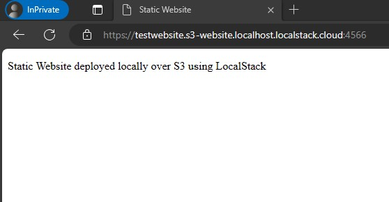
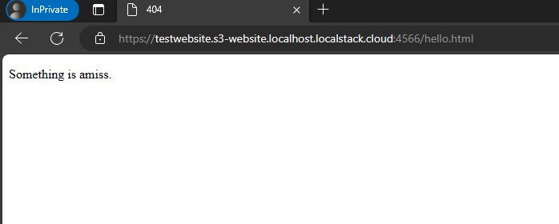

# Terraform and LocalStack Static Website Example

## Introduction
built using the LocalStack Tutorial [S3 Static Website Terraform](https://docs.localstack.cloud/tutorials/s3-static-website-terraform/)

## Deploy To Local Stack
To deploy the example code to local stack on the local machine, from the infrastructure folder ensure that local stack is running
```
$ localstack start
```
Once local stack is running we need to initialise terraform ready for the planning and deployment, run the following to initialise terraform for deployment to localstack
```
$ tflocal init
```
once terraform has been initialised, run the following command to plan the deployment
```
$ tflocal plan
```
review the plan and run the following command to deploy the static website to localstack
```
$ tflocal apply
```
the bucket name will have to be given and the deployment actions confirmed, once completed the resulting website will be available on 
```
https://<bucket name>.s3-website.localhost.localstack.cloud:4566/
```

## Architecture
This is a simple example static website with two html pages "index.html" and "error.html", uploaded to an aws s3 bucket that has been configured for public read access and to behave as a web server.

### Example Browser Output





## Solution Structure

### architecture
this directory holds all the documentation and the structuizr platform for display and exploration of this documentation.

### infrastructure
this directory holds all the files to create the applications infrastructure, in this case written in Terraform script.

### src
this directory holds all the source code for the application, in this case the pages are stored in a sub directory www.
